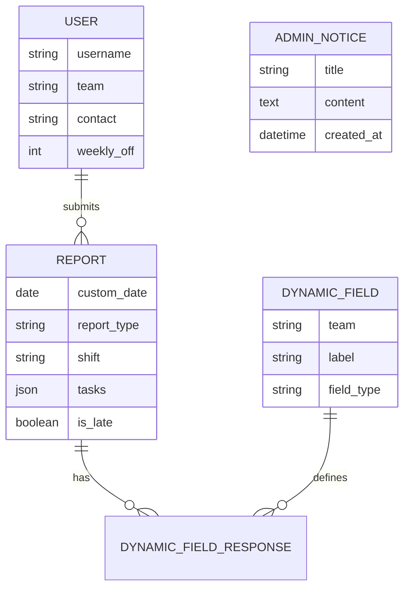

# 📄 Reporting ERP Documentation

Welcome to the official documentation for **Reporting ERP**. This system is designed to streamline daily reporting for media and content teams, providing a robust platform for tracking tasks, attendance, and team performance.

---

## 🏗 Project Overview
Reporting ERP is a Django-based application tailored for teams like Video Editors, Producers, Content Writers, and Marketing professionals. It replaces messy spreadsheets with a centralized, dynamic reporting tool that tracks daily progress, shifts, and leave status.

### Core Objectives:
- **Centralization**: All team reports in one place.
- **Dynamicism**: Custom fields per team role.
- **Accountability**: Automated tracking of late submissions and missed days.
- **Insight**: Exportable data for management analysis.

---

## 🚀 Key Features

### 👤 For Users (Team Members)
- **Daily Reporting**: Interactive forms to log daily tasks.
- **Shift Management**: Select from predefined shifts or WFH.
- **Attendance Tracking**: Mark days as 'Regular' or 'Leave'.
- **Personal Dashboard**: A calendar view showing submission history and upcoming weekly offs.
- **Late Submission Detection**: System flags reports submitted after the due date.

### 🛠 For Admin (Management)
- **Global Overview**: View all reports across all teams with advanced filters.
- **User Management**: Manage team assignments, contact details, and weekly offs.
- **Dynamic Field System**: Add or remove report fields (Number, Text, Date, etc.) for specific teams without touching code.
- **Notice Board**: Post announcements that appear on user dashboards.
- **Excel Export**: Bulk download reports for custom reporting and payroll integration.
- **Password Management**: Administrative control over user access.

---

## 🛠 Technical Architecture

### Tech Stack
- **Backend**: Django 5.0 (Python 3.11+)
- **Database**: PostgreSQL
- **Frontend**: Bootstrap 5, FullCalendar.js, Vanilla CSS/JS
- **Containerization**: Docker & Docker Compose
- **Data Processing**: Pandas (for Excel exports)

### Database Models


---

## 📦 Installation & Setup

### 🐳 Using Docker (Recommended)
1.  **Clone the repository**:
    ```bash
    git clone <repo-url>
    cd reporting_erp
    ```
2.  **Set up environment variables**:
    Copy `.env.prod.example` to `.env` and update the values.
3.  **Build and Run**:
    ```bash
    docker-compose up -d --build
    ```
4.  **Create Superuser**:
    ```bash
    docker-compose exec web python manage.py createsuperuser
    ```

### 🐍 Manual Setup (Development)
1.  **Install dependencies**:
    ```bash
    pip install -r requirements.txt
    ```
2.  **Configure Database**: Update `media_reporting/settings/dev.py` with your database credentials.
3.  **Run Migrations**:
    ```bash
    python manage.py migrate
    ```
4.  **Start Server**:
    ```bash
    python manage.py runserver
    ```

---

## ⚙️ Configuration

### Adding New Teams
Teams are defined in `reports/models.py` under `User.TEAM_CHOICES`. Adding a team requires a migration.

### Dynamic Fields
1.  Log in to the **Management Portal** (`/management-portal/`).
2.  Navigate to **Dynamic Fields**.
3.  Create a new field, assign it to a team, and choose the type (e.g., Number for "Videos Edited").
4.  Users in that team will immediately see the new field on their submission form.

---

## 🔐 Security Note
- The Django admin panel is obscured at `/management-portal/`.
- Shift the `DEBUG` setting to `False` in production.
- Use the provided `security_audit.log` to monitor access patterns.

---

## 🗺 Roadmap
- [ ] Profile editing for users.
- [ ] Automated email reminders for missed reports.
- [ ] Multi-level approval workflow.
- [ ] Mobile application (React Native).

---

© 2024 Reporting ERP Team. Built for efficiency.
